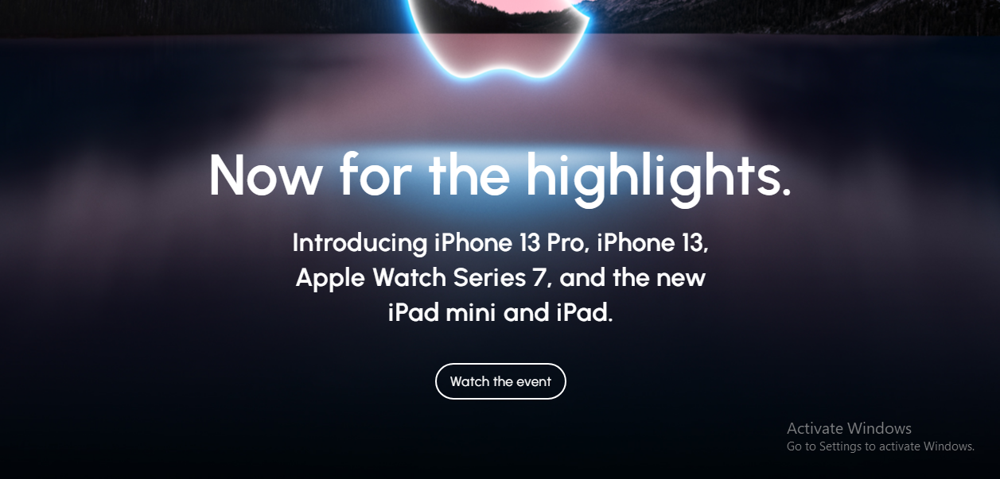
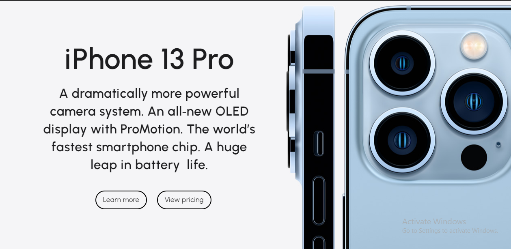
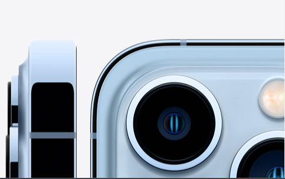

# Apple Clone

[checkout here](https://nabeelahmed1699.github.io/Apple-clone/)

I've created apple website clone .

- Navbar
   
  
   
   
   

- Header
   
  
   
   
   
- Section
   
  

### Responsive

- Navbar
   
  
   
   
   

- Header
   
  
   
   
   
- Section
   
  
  
